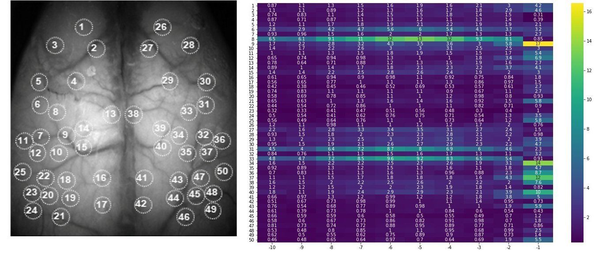

# Behavior-Prediction-with-Calcium-Imaging-Data

## 1. 50 region trace data (MLP, LSTM, Self-Attention)

### Result (LSTM)

### SHAP Value (LSTM)

### Environment
Anaconda
Python 3.6
tensorflow-gpu==1.15.0
keras==2.3.1
shap==0.36.0
keras-self-attention==0.47.0

### Reference
「Kerasで多変量LSTM」 (https://qiita.com/tizuo/items/b9af70e8cdc7fb69397f) https://github.com/tizuo/keras (GPL-3.0 License)
___

## 2. Image sequence data (CNN + LSTM)

### Result

### Cut-Out Importance

### Environment
Anaconda
Python 3.6
pytorch==1.7.0+cu92
tifffile==2020.2.16
opencv-python==4.4.0.46
efficientnet-pytorch==0.6.3
tqdm==4.40.2

### Reference
CNN + LSTM - Pytorch [Train] https://www.kaggle.com/orkatz2/cnn-lstm-pytorch-train (Apache License 2.0)

___

## Publication

Takehiro Ajioka, Nobuhiro Nakai, Toru Takumi, 2021, Prediction of Mouse Behavior with Deep Learning, *The 44th Annual Meeting of the Japan Neuroscience Society (The 1st CJK International Meeting)*

## Author
Takehiro Ajioka

E-mail:1790651m@stu.kobe-u.ac.jp

## Affiliation

Department of Physiology, Kobe University School of Medicine

神戸大学医学研究科　生理学分野
