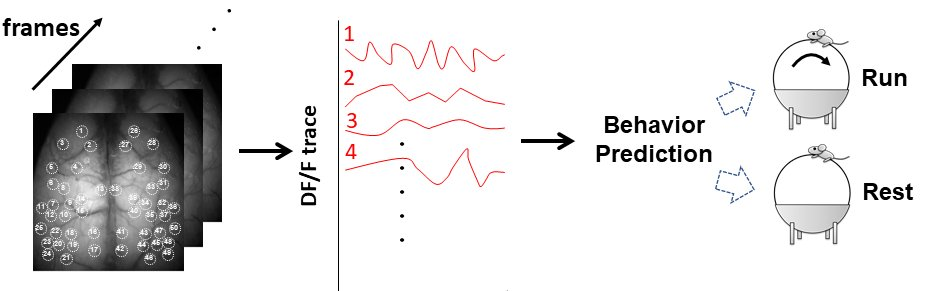

# Behavior-Prediction-with-Calcium-Imaging-Data

## 1. 50 region trace data (MLP, LSTM, Self-Attention)

#### Result

#### Environment
Anaconda
Python 3.6
tensorflow-gpu==1.15.0
keras==2.3.1
shap==0.36.0
keras-self-attention==0.47.0

## 2. Image sequence data (CNN + LSTM)

#### Environment
Anaconda
Python 3.6
pytorch==1.7.0+cu92
tifffile==2020.2.16
opencv-python==4.4.0.46
efficientnet-pytorch==0.6.3
tqdm==4.40.2

#### Reference
CNN + LSTM - Pytorch [Train] https://www.kaggle.com/orkatz2/cnn-lstm-pytorch-train (Apache License 2.0)

## Author
Takehiro Ajioka

E-mail:1790651m@stu.kobe-u.ac.jp

## Affiliation

Department of Physiology, Kobe University School of Medicine

神戸大学医学研究科　生理学分野
